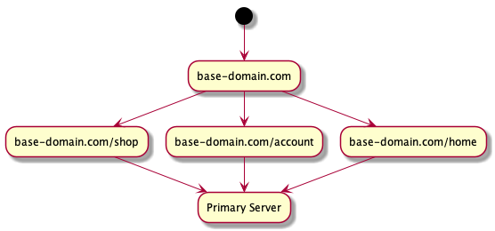
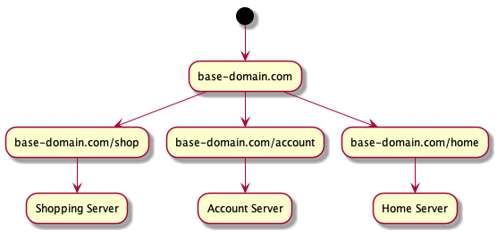

# The Big Guide: Micro Frontend Composition with Web Components

## Embedded, Isolated Client-Side Applications Built With React

#### Table of Contents:

- [Introduction](#introduction)
- [What are Web Components](#what-are-web-components)
- [Why Build. Web Components With React? Why Not Just _Use React_](#why-build-web-components-with-react-why-not-just-use-react)
- [The Functionality Problem](#the-functionality-problem)
  - [`ReactHTMLElement`](#reacthtmlelement)
  - [Rendering Externally-Provided Children](#rendering-externally-provided-children)
  - [Inter-Component Communication](#inter-component-communication)
  - [Styles](#styles)
    - [Styled Components](#using-the-html-template-in-our-web-component)
    - [Fonts](#fonts)
  - [React Portals and `document.body`](#react-portals-and-documentbody)
- [Web Components as Micro Frontends](#web-components-as-micro-frontends)
  - [Building Micro Frontends](#building-micro-frontends)
    - [Javascript Isolation](#javascript-isolation)
    - [Intelligently Utilizing Browser Caching](#intelligently-utilizing-browser-caching)
  - [File Naming, Cache-Busting, and Deployment](#file-naming-cache-busting-and-deployment)
    - [Deploying Independently](#deploying-independently)
    - [What About Breaking Changes? - Versioning](#what-about-breaking-changes---versioning)
- [Wrap-Up](#wrap-up)
- [Appendix A: About Browser Compatibility](#appendix-a-about-browser-compatibility)
- [Appendix B: Best Practices](#appendix-b-best-practices)

## Introduction

Our team at [Willis Towers Watson](https://www.willistowerswatson.com/) wanted
to find a way to deploy multiple small applications that exist side-by-side on
the same webpage. In this, we're not talking about multiple _elements_ of a page
(like a form or an accordion or some other UI element), but individual
applications — encapsulated pieces of business functionality, like a shopping
cart, or something that updates household information. Further, we wanted to
find an approach that would allow greater than a dozen teams to separately
develop, build, and deploy their apps in isolation without having to have
multiple gates (other people, teams, etc) in order to get new code into
production. (This approach is often called
[Micro Frontends](https://micro-frontends.org/).)

We researched a lot of different ways of handling this problem, but finally
landed on utilizing Web Components as our solution. This allows us to deploy
individual, isolated Javascript applications together on a single page without
responsibility on other teams to expend a lot of work to integrate those
components.

The main web technology our shop uses is React, so building Web Components with
React is a primary need for us. We've learned a lot as we've tread that path,
and this article will detail much of that learning.

## What are Web Components?

[MDN has a very thorough and clear guide on Web Components](https://developer.mozilla.org/en-US/docs/Web/Web_Components),
but in the simplest terms, Web Components are a way to build encapsulated
elements rendered in isolation from the other elements on the DOM. This
isolation allows you to have modularity and portability in individual
client-side components, indifferent to their surrounding context.

This portability and isolation can enable many of the benefits of Micro
Frontends, which is why we decided to pursue Web Components as a Micro Frontends
solution.
[We'll discuss this at length later.](#web-components-as-micro-frontends)

But if we're using React, isn't some of that portability and isolation already
built in?

## Why Build Web Components With React? Why Not Just _Use React_?

In a Web Component, you're not limited in the technology you use. Any approach
should be feasible, but if you're already using a technology like React, why not
simply ship shared React components for different pieces of functionality?

There are a few answers to this question:

1. Independence: shared components within the React system depend on a common
   set of React functionality. If you're building a component, and you want to
   use a newer feature, but the global version of React in your system does not
   support this feature, then you simply can't use it. A Web Component has no
   need to have a top-down version of React dictating the features it can use.
   The Web Component can use the version it needs.

2. Evolvability: the isolation of Web Components allows to you use React or
   really any other technology you see fit. If your team decides that something
   better or more fitting has come along for your Web Component, you can change
   it without worrying about affecting the surrounding page. Or you can build a
   Web Component without any third-party library at all, and it can integrate in
   any web page easily (even those built with React).

3. Deployability: this is likely the most important answer. One of the main
   concerns that a Micro Frontends approach aims to alleviate is a lack of
   dependency on external teams when deploying an application. If you're using
   React to piece together your frontend, all of your components need to be up
   to date at build time. With a Web Component whose source is hosted on an
   independent server, you can deploy new source code (which we
   [go into detail about](#file-naming-cache-busting-and-deployment) below), and
   your downstream dependents will be updated automatically.

There are some limitations and hurdles when it comes to using React in Web
Components, and some questions we wanted to answer as we approached the idea
Let's talk about those. The first is the problem of lost functionality.

## The Functionality Problem

The
[React Docs describe a way you can use React to render Web Components](https://reactjs.org/docs/web-components.html#using-react-in-your-web-components),
but a deeper exploration of this idea reveals an issue with React 16: anything
that uses events within your React Web Component to update the internal state
simply does not work. You can
[see an example of this broken functionality on this Sandbox](https://codesandbox.io/s/react-web-component-without-retargeting-events-b61u3?file=/src/index.js).

The solution to this problem is to retarget events to the Shadow DOM, rather
than to the original root node of the mounted element (`document.body`).
[This React issue](https://github.com/facebook/react/issues/9242) describes a
few different ways to solve this problem, most notably
[`react-shadow-dom-retarget-events`](https://github.com/spring-media/react-shadow-dom-retarget-events),
which works by adding an event listener for react-specific events to the Shadow
DOM. This method works, to an extent, but can potentially be brittle (like if
React adds new events). We wanted a less potentially-brittle solution.

### ReactHTMLElement

Our approach has been a little bit different from
`react-shadow-dom-retarget-events`: we wrote a Javascript Class called
[`react-html-element`](https://github.com/WTW-IM/react-html-element) that
extends `HTMLElement`, creates a Shadow DOM, adds the appropriate
`createElement` functions to it, and sets the Shadow DOM as the `ownerDocument`
for the `mountPoint` where your React app is intended to be mounted. This solves
the event retargeting problem in a robust way because it doesn't depend on any
specific React implementation details, and simply allows the Shadow DOM to
capture all events from within the React application. You can see the
[same example from above, but using `ReactHTMLElement` ](https://codesandbox.io/s/react-web-component-with-reacthtmlelement-7gsrj?file=/src/index.js),
and now the functionality is working.

This was our first consideration, as it is the most clear problem when building
Web Components with React. The next problem we wanted to solve was: how do we
render HTML Children within a Web Component?

> 🚨 React 17 should solve the issue described above. You may _not_ want to use
> `ReactHTMLElement` if you're on React 17. We plan shortly to release an update
> that will include some of the nice-to-haves of `ReactHTMLElement`, but relying
> on React 17 to solve the event targeting problem.

## Rendering Externally-Provided Children

The Web Components APIs provide
[a very simple way of rendering children using `<slot>` tags](https://developer.mozilla.org/en-US/docs/Web/Web_Components/Using_templates_and_slots#Adding_flexibility_with_slots).
Luckily, we found that using `<slot>` in React was easy, and it just works. You
can manage `<slot>` tags with `name` attributes, but the absolute simplest way
is just to include a bare `<slot>` tag in your React component:

```jsx
export default function AppWithSlot() {
  <div>
    Here are my children:
    <div>
      <slot></slot>
    </div>
  </div>;
}
```

With that in place (and with your app registered as a Web Component called
`react-app`), your HTML could look something like this:

```html
<html>
  <head>
    <!-- load your js, Web Components polyfills, etc -->
  </head>
  <body>
    <react-app>
      <div>
        Any children can go in here, including other Web Components, and even
        other Web Components built with React.
      </div>
    </react-app>
  </body>
</html>
```

That's it! A very simple solution built right into the browser!

The next question we wanted to answer was: how do Web Components communicate
with each other?

## Inter-Component Communication

For our purposes, we want our Web Components to have as little need for
knowledge of their surrounding context as possible. We expect there to be very
little if any chatter between our Micro Frontends, and prefer that these
individual Components be responsible for their own data management and
gathering. For us, this typically means utilizing the authentication session to
get access to a user ID to work from. However, though we may limit those
cross-domain interactions, there will always be at least some need for pieces of
a webpage to know that another piece changed something. There are really three
ways to handle this problem:

1. You can pass data on attributes to a Web Component. This works and is part of
   the expectation of Web Components, but this data, as with traditional HTML
   elements, can only only be in primitive types, like strings and numbers. This
   is good for very simple data transfer from a parent directly to a child.

   When using this method, remember that traditional HTML attributes
   [are case-insensitive](https://w3c.github.io/html-reference/documents.html#case-insensitivity),
   so make sure you're using attributes like `userid` or `user-id` and not
   `userId`.

2. You can
   [build a Web Component with a JavaScript API](https://developers.google.com/web/fundamentals/web-components/customelements#jsapi),
   and pass data into the Web Component using a reference to the element itself
   by calling the Javascript API you have defined. This method is good, but has
   some limitations in that whatever wants to use the API must have a reference
   to the component itself, which means that one component would need to
   explicitly know about the presence of another one.

3. Probably the simplest way for Web Components built with React is to use
   events on the Window. An app can emit a Window event, and another can listen
   for it to update based on any information that has changed.

   Using events has a few key benefits:

   - Eventing is a
     [robust way of transferring complex data objects](https://developer.mozilla.org/en-US/docs/Web/Guide/Events/Creating_and_triggering_events).
   - The implementation of a listener or dispatcher can be close to the point
     where that event information is generated or utilized.
   - Your components can dispatch an event without knowing what might be
     listening.
   - Listeners can respond to events without knowing what element might dispatch
     it.

We would caution that, if Web Components are showing a lot of chattiness between
domains, there may be a problem in your segregation. This can often happen when
you've gone _too far_ with separating concerns.

So with the issue of communication between Components resolved, we could tackle
our next challenge: styles.

## Styles

Styles in Web Components have some unique constraints:

- Styles specific to the Component must be contained within the Component itself
- `<link>` tags do not work within Web Components. Styles for the Component must
  be in `<style>` tags.
- `@font-face` rules must be loaded on the global document, and cannot be loaded
  from within a Web Component.

There are other concerns, as well, when dealing with our particular build
process. Most of our teams use a very common set of tools in the React
community: webpack, Babel, and styled-components. These tools make bundling apps
for the web very easy, but the above styling constraints bring an extra level of
complexity. By default, styled-components applies your styles to the `<head>` of
your HTML, but we need them applied inside the Shadow DOM.

### Styled Components

Luckily, styled-components gives us a simple solution for the problem of
relocating style tags: the
[`StyleSheetManager`](https://styled-components.com/docs/api#stylesheetmanager).
This allows you to provide a node where the styles will ultimately land. So for
a Web Component, you don't need to do much more than wrap your App in a
stylesheet manager. A Web Component using
[`ReactHTMLElement`](#reacthtmlelement) and `StyleSheetManager` might look like
this:

```jsx
class ReactWebComponent extends ReactHTMLElement {
  connectedCallback() {
    ReactDOM.render(
      <StyleSheetManager target={this.mountPoint.parentNode}>
        <App />
      </StyleSheetManager>,
      this.mountPoint
    );
  }
}
```

To be clear, we use `this.mountPoint.parentNode` for the styles instead of
simply using `this.mountPoint` for the case of unmounting. If stylesheets are
the first child of `this.mountPoint`, ReactDOM will throw an error when you try
to unmount,
(`unmountComponentAtNode(): The node you're attempting to unmount was rendered by another copy of React.`)
This error is a little cryptic, but the bottom line is that ReactDOM expects
that everything inside the mounted node was generated by React itself. When we
use the same node to place our styles, it breaks that expectation.

There is one case where you do not want your Web Component code to be contained
inside your Shadow DOM: Fonts.

### Fonts

Fonts _do_ need to be set globally. For our case, all of our pages start with a
shop-wide page template, and are loaded with the appropriate fonts and an icon
font by default, so we don't have to do anything clever to expect that to work.

If you don't have the luxury of expecting the fonts to be already on the page,
and want to ensure that fonts used in your Web Component are available on pages
that load them, we recommend injecting a `<link>` tag for your font to the
`document.head` from within your Web Component JavaScript. A function to do that
could look like this:

```javascript
function injectFont(sheet: string) {
  const foundSheet = document.querySelector(`link[href="${sheet}"]`);
  if (foundSheet) return;

  const link = document.createElement("link");
  link.setAttribute("rel", "stylesheet");
  link.setAttribute("href", sheet);
  document.head.prepend(link);
}
```

Unfortunately, there doesn't seem to be a way to do this without interacting
with the global `document`, but the function above will at least prevent loading
the same stylesheet more than once.

With all those questions answered, we set out to implement some Web Components
using our custom library of React Components,
[`es-components`](https://github.com/WTW-IM/es-components), but in doing so, we
discovered some other issues, particularly with things like Modals, which expect
to be attached to the `document.body`.

## React Portals and document.body

Some of the components in `es-components` use `ReactDOM.createPortal` in order
to inject dynamic content onto the page. Our implementation was initially
unaware of Web Components, and simply used `document.body` as the target for
those created elements. This had a problem when trying to utilize those
components within a Web Component because the injected content would land
outside our Shadow DOM, and would thus lose its styling. So how can we ensure
our component does the right thing when inside a regular `document.body`, and
also does the right thing when it lives within a Shadow DOM?

The key here, for us, was to use the
[`getRootNode`](https://developer.mozilla.org/en-US/docs/Web/API/Node/getRootNode)
function on the `Node` prototype, but we couldn't just use it directly.

When `getRootNode` returns `document`, we needed to drill down to
`document.body` because attempting to append a child to the `document` directly
produces the error
"[Failed to execute 'appendChild' on 'Node': Only one element on document allowed](https://stackoverflow.com/a/48938528)."

In order to circumvent this error, we created a React hook called
[`useRootNode`](https://github.com/WTW-IM/es-components/blob/master/packages/es-components/src/components/util/useRootNode.js)
that appropriately returns `document.body` when a component ref is on the
`document` directly, or the correct shadow root when the ref is within a Shadow
DOM. This allowed us to use the value from `useRootNode` to target our
`React.createPortal` calls, rather than naively pointing only to
`document.body`.

With that solved, we could talk about putting the picture together.

## Web Components as Micro Frontends

For our purposes, we wanted to deploy Web Components so that individual pieces
of functionality could be deployed on the same page by different teams with only
loose dependencies on each other. Micro Frontends are the architectural approach
that allow us to solve that problem, and there are
[many solutions](https://www.angulararchitects.io/post/2017/12/28/a-software-architect-s-approach-towards-using-angular-and-spas-in-general-for-microservices-aka-microfrontends.aspx),
each with tradeoffs and benefits. For us, we had a few main goals:

- We wanted runtime dependencies rather than build-time dependencies. We didn't
  want to have a slew of static dependencies that would cause a deployment train
  every time a new change was introduced.
- We wanted deployability isolated with individual teams. We didn't want
  individual
  [Bounded Contexts](https://martinfowler.com/bliki/BoundedContext.html) to have
  to be gates for other Bounded Contexts to getting new features or iterations
  into production.
- As much as we could avoid it, we didn't want any top-level decisions affecting
  individual Micro Frontends. We wanted to avoid having to define a page-level
  version of React and forcing each Micro Frontend to conform, for example.
- We wanted to avoid heavy tooling that would require a lot of coordination and
  maintenance between teams, demanding time and attention from people where it
  could be better spent doing the actual work of building the product.

Web Components gave us almost all of these things by default, but as we
approached it, we wanted to make a couple of recommendations to keep things as
good as possible for our users. The first consideration was ensuring that our
bundle sizes were as small as they could be.

### Building Micro Frontends

If you're using a client-side bundler like webpack, it's very easy to bundle
third-party dependencies into your application code and get isolation within
your bundle that way. In our case, when we have multiple individual Web
Components on a single page, we wanted a way for each of these components to
keep their bundle sizes low by loading third-party dependencies separately. If
two Web Components were to rely on the same third-party package, they would both
load the dependency separately, and rely on browser caching to only transfer it
over the wire once.

This begets two problems, though, the first being that Web Components don't have
enough JavaScript isolation to globally load two separate versions of one
dependency.

#### Javascript Isolation

This is a glaring problem: Web Components are very isolated in every sense
_except for in JavaScript_. The `window` and `document` in a Web Component are
the same `window` and `document` in the surrounding page. So any third-party
dependency would either need to be externalized to the `window`, causing us to
have to make a top-down decision about dependencies and versions that our Web
Components can rely on, or we'd need some way to isolate these external
dependencies without simply packaging them into our bundles.

We much preferred the second option, but couldn't find a way to do it, so we
built one. Our teams are all using webpack for their build, so we wrote a
webpack plugin to wrap the bundles in a closure, and include any
[`externals`](https://webpack.js.org/configuration/externals/) within the
closure. This allows our application to refer to the `externals` as global
dependencies, without the need for those externals to actually be on the global
context. The resulting package is called the
[`isolated-externals-plugin`](https://github.com/WTW-IM/isolated-externals-plugin).
Utilizing this plugin allows us to load a UMD package more than once on the same
page without polluting the `window` object (so long as those UMD bundles refer
to `this` and not the `window` directly). The `isolated-externals-plugin` also
provides some behavior which ensures that resources at the same URL will only be
loaded once over the wire, even if they are not already cached.

There are trade-offs here, the primary one being that the resulting JavaScript
heap will include these dependencies more than once. That's true, but we'd run
into that same problem if we were bundling our dependencies into our
applications anyway. This way, we do end up having those dependencies in the
heap more than once, but we only need to load them over the wire a single time.

The second problem uncovered by the effort to isolate our external dependencies
is a particular one. What if one Web Component were to refer to an external
dependency at one minor or patch version, and another referred to the same
dependency at the same major version, but at a different minor or patch version?
We'd end up transferring two packages over the wire, but probably unnecessarily.

#### Intelligently Utilizing Browser Caching

We'll have a very slow-loading page if we have many Web Components loading
separate versions of external dependencies independently, but we can solve this
problem in two steps.

1. Use [`unpkg`](https://unpkg.com/) as our "official" CDN to load these
   external dependencies.
2. Utilize `unpkg`'s [semver](https://semver.org/) range functionality to refer
   only to the major version of your dependencies. This way, even if one Web
   Component was built on React@16.13.0 and another one was built on
   React@16.13.1, they can both use
   [unpkg.com/react@16/umd/react.production.min.js](https://unpkg.com/react@16/umd/react.production.min.js)
   at runtime. With that url (`@16` being the key portion), both Components will
   load the latest version of React@16, which will include the functionality of
   the previous minor and patch versions.

Doing these two things allows us to ensure that, generally, we'll only load a
major version of a dependency over the wire once. Should teams see a need to be
very specific about their versions, they can still specify an exact version, but
for most cases, we'll be safe loading the versions of dependencies we need, and
still limiting the bytes we transfer over the wire.

With a solution for caching our external dependencies in place, we could focus
on a solution for caching and refreshing our bundles.

### File Naming, Cache-Busting, and Deployment

The traditional way of ensuring that browsers load the newest version of a
javascript application is to append a new hash onto the filename with each
deployment (so `main-abc123.js` becomes `main-xyz789.js`), and to set
`Cache-Control` Headers for these files to keep assets for a long time. For our
case, we don't want downstream teams to know about a new hash because we don't
want teams to need to be aware that a new version of a component has been
released. For us, adding a hash to the filename would not work.

Instead, we decided to have our Components delivered with static file names
(something like `shopping-component.js`), and we would rely on the
[`ETag` Header](https://developer.mozilla.org/en-US/docs/Web/HTTP/Headers/ETag)
and the built-in browser behaviors around it to manage cache busting.

To allow `ETag` Headers to work, the server that delivers the static files
simply needs to generate an `ETag` value for each new version of the file to
compare against. When the browser requests the static resource, it should send
that `ETag` Header and value on the response with the content. When the browser
sends a request for a file with an `ETag` Header value that matches the file on
the server, the server returns a `304 Not Modified` response, causing the
browser to fall back to its cached resource. When the `ETag` values are
mismatched, the server will send back the new version of the file along with a
`200 OK` response.

In our case, most of our applications are built with
[.NET Core](https://docs.microsoft.com/en-us/dotnet/core/). In that framework,
the
[`useStaticFiles` middleware](https://docs.microsoft.com/en-us/aspnet/core/fundamentals/static-files?view=aspnetcore-3.1#serve-files-inside-of-web-root)
does the right thing with `ETag` headers out of the box. It will return a new
`ETag` value for changed files, and will return a `304 Not Modified` response
when the requested asset is unchanged.

There are tradeoffs with utilizing the `Etag` Header to manage caching:

- The browser has to make a request to the server to confirm the `ETag` value.
- There isn't a one-size solution to utilize `Cache-Control` Headers.

There are some mitigating factors there, though:

- The size of the 304 response is a few hundred bytes, which is typically
  minuscule compared to your actual bundle size (generally some tens-to-hundreds
  of kilobytes).
- If you're delivering a static file where you have a good understanding of the
  change rate, then you can set up `Cache-Control` Headers to meet the needs of
  your specific case. (That is, you know you deploy new code about every day,
  week, month, etc.)
  - If you want to validate the `ETag` Header every time your script is loaded,
    set the `Cache-Control` Header on the response of your static files to
    `"must-revalidate"`; this tells the browser to always check with the server
    before reloading from the cache.

Understanding how we can deploy these files with a static name and consistent
cache busting is really good, but in itself, it's not enough to give us the
independence for teams that we're looking for. For that, teams need to be able
to deploy their applications independently, without the need to notify other
teams of a change, or the need step on the toes of other teams by deploying
through the same deployment pipeline.

#### Deploying Independently

There are a number of ways to solve the problem of isolated, independent
deployments, but our solution is to utilize right-hand routing (configured in a
load balancer) to determine which servers a particular request should go to.

In a traditional or monolithic application, traffic might move a little bit like
this:



For our purposes, we use the path (the "right-hand route") to determine which of
any number of servers to send traffic to:



This allows our teams to manage their entire business domain (or Bounded
Context), from how business logic is handled on the server side to how display
and inputs are handled on the client side.

In order to deliver Web Components as single JavaScript files from multiple
different servers, we simply deploy those files to these independent servers,
and refer to them using our path-based routing. For example, a Shopping web
component url may be something like
`base-domain.com/shop/shopping-component.js`, which will be delivered by a
server in the Shopping Bounded Context. For a separate Bounded Context, like
Account, you might have a similar url for a Web Component — something like
`base-domain.com/account/account-component.js` — which is delivered from a
server in the Account Bounded Context.

With these pieces in place, a webpage can load different components from
different servers, independently managed and deployed by disparate teams, with
the confidence that new code will be properly cache-busted on the client side.

So, we've got consistent cache busting and independent deployments, all under
the control of a single team, and that's great, but what about when a Web
Component has to change in some fundamental way?

#### What About Breaking Changes? - Versioning

Breaking changes are anything that would cause an error or disruption to our
dependents. When talking about Web Components, things that fit into that
category are:

- Anything that changes the expected size of the Component in the browser.
  - This is Component-specific. Some scenarios using Web Components may allow
    for certain changes in size without considering them to be breaking.
- Changing
  [observed attribute](https://developer.mozilla.org/en-US/docs/Web/Web_Components/Using_custom_elements#Using_the_lifecycle_callbacks)
  names (without backwards-compatibility).
- Changing the surface or contracts of the Component's custom Javascript API.
- Changing the names of emitted events.
- Changing the shape of the data in emitted events.

In our case, we recommend versioning URLs like you might do in a REST API. So if
your original release is something like
`/cart/web-components/v1/cart-button.js`, a breaking version can simply be
`/cart/web-components/v2/cart-button.js`. Doing this allows a team to release a
new, breaking version of a Web Component without automatically breaking
downstream clients. Conversely, it also allows downstream clients to update to
the breaking version at their pace.

If your use case includes a single Web Component with the potential to be used
more than once in the same page session, breaking changes may also merit
changing the name of the Web Component itself. For example, something like a
`<logout-button>` Component may be used in your header nav and may also be
present as a button on a profile page. In our case, it would be very likely that
the team which has ownership of the navigation menu does not have ownership of
the profile page, and so they may not want to update with breaking changes to
`<logout-button>` at the same time (depending on team priorities). That being
the case, you may need to also version the name of the Web Component. This can
be as simple as `<logout-button-v2>`. This way both Web Components can be
registered with `window.customElements` without clashing, and those still using
the old Web Component can continue on using it until they're ready to update.

It's important to note that, following the
[`Semantic Versioning model`](https://semver.org/), the URL and tag version of
Micro Frontend Web Components should only be updated with major versions and on
breaking changes. These URL-versioned or tag-versioned releases eliminate the
ability to release the new change without downstream cooperation. Any dependents
will need to manually update the Web Component's URL and/or HTML tag to get the
new version, so releasing new major versions for changes that aren't breaking,
or releasing minor or patch versions in the URL will severely hinder a team's
flow of continuous improvement.

## Wrap-Up

All the considerations above made it possible for our teams to utilize Web
Components as our primary means for delivering Micro Frontends that exist
alongside each other on a single webpage, are built in React, can communicate
with each other, and are deployed by different teams independently, and without
the need for heavy-handed, top-down decisions or tooling. The ultimate result of
all this is that teams can move quickly and in parallel to iterate on features
within their individual domains, and to steadily improve our product over time
for our users.

## Appendix A: About Browser Compatibility

With
[Microsoft Edge moving to a Chromium base](https://support.microsoft.com/en-us/help/4501095/download-the-new-microsoft-edge-based-on-chromium),
all major browsers now natively support Web Components. If you need to support
older browsers, the
[Web Components polyfills](https://www.webcomponents.org/polyfills) do an
excellent job of providing backwards-compatibility.

We were having a very difficult time getting our components to function properly
in pre-Chromium Edge, so we've added a banner to our site that appears for older
versions of Edge (and IE11 and below) that encourages users to update to the new
Edge (which will happen automatically for Edge-users anyway
[with Windows updates](https://docs.microsoft.com/en-us/deployedge/microsoft-edge-sysupdate-windows-updates)),
or to another evergreen browser.

## Appendix B: Best Practices

Google has a
[list of best practices](https://developers.google.com/web/fundamentals/web-components/best-practices)
with Custom Elements, which is helpful and can help you avoid some pitfalls,
like accidentally creating infinite loops.
